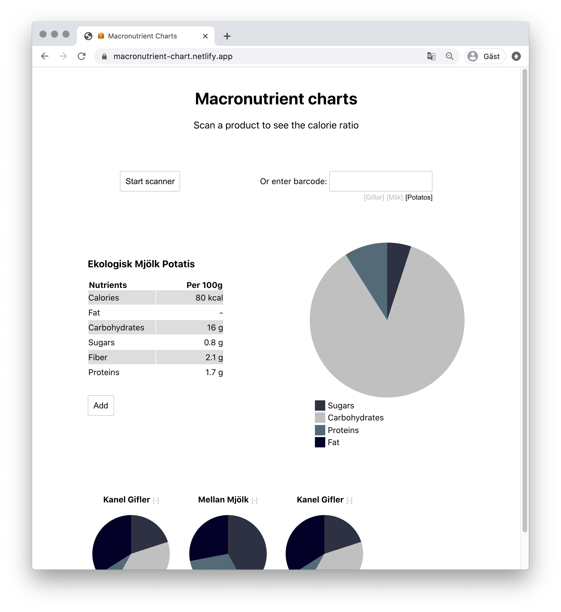

# Macronutrient Charts&ensp;|&ensp;[View Live &#10555;](https://macronutrient-chart.netlify.app/)

A web app that scans barcodes on food packages and retrieves product information from the open source database openfoodfacts.org

The scanner was built around a provided Quagga component. A Redux store with reducers handles the product information and a list of saved products. Redux thunk middleware handles the asynchronous API call and store the state of the app when loading to display a loading spinner. 

The data is presented as pie charts of the macronutrient ratio for the food items. This is done using the Conic Gradient property in CSS. (More about this trick [here](https://css-tricks.com/snippets/css/css-conic-gradient/)) Styling is done using Styled Components.

Try it out using the links under the input field if you don't have any food items around.

## Core Tech
* React
* React Redux
* Redux Thunk
* Redux Toolkit
* Styled Components
* CSS3

## Screenshot

## View it live
https://macronutrient-chart.netlify.app/
